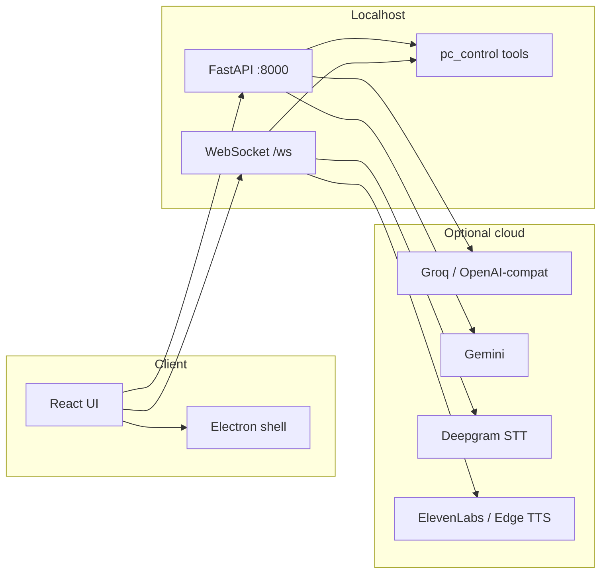

# ANAY Desktop

ANAY Desktop is a **local-first AI assistant** for your PC: chat and voice go through a FastAPI backend that can run **tools** on your machine (open apps and URLs, clipboard, screenshots, shell commands, reminders, and more). The UI is a **React** app served by **Vite**; an optional **Electron** shell adds a tray icon, borderless window, and global hotkey.

Nothing in the default design sends your screen or keystrokes to the cloud unless you configure cloud LLM or speech providers and call those features.

---

## What this project does

| Area | Description |
|------|-------------|
| **Chat** | Text chat hits `POST /api/chat` and is routed to Groq, NVIDIA NIM (MiniMax), Ollama, or Gemini depending on settings and keys. |
| **Voice** | WebSocket session: audio chunks, STT (e.g. Deepgram), same LLM router, TTS (ElevenLabs or Edge TTS). |
| **PC control** | Python tools (`pc_control.py`) use `subprocess`, `webbrowser`, `pyautogui`, `psutil`, etc., on the same machine as the backend. |
| **Intent shortcuts** | High-confidence phrases (e.g. “open YouTube”, “launch Chrome”) are handled by `intent_router.py` so common actions work even if the model does not call a tool. |
| **Memory** | SQLite for structured memory, reminders, and agent tasks; optional **ChromaDB** for semantic search when installed. |
| **Vision** | `POST /api/vision/inspect` captures the desktop and runs a vision-capable model with your prompt. |
| **Metrics** | Live CPU/RAM/OS uptime via WebSocket `system_metrics` and `GET /api/desktop/state`. |
| **Desktop shell** | Electron loads the Vite dev URL in development, or `frontend/dist` when packaged; packaged builds can spawn the Python backend from the app directory. |

---

## Repository layout

```text
ANAY-DESKTOP/
├── backend/                 # FastAPI app (main.py), LLM router, tools, voice, vision
│   ├── .env                 # Local secrets (not committed); see .env.example
│   ├── requirements.txt     # Pinned Python dependencies
│   └── ...
├── frontend/                # React + TypeScript + Vite + Tailwind + shadcn/ui
│   ├── src/
│   └── vite.config.ts
├── electron/                # Electron main process, preload, tray, backend launcher
│   ├── main.js
│   ├── run_backend.js       # Dev: spawns uvicorn with venv discovery
│   └── preload.js
├── memory/                  # Created at runtime: SQLite DB + optional Chroma data
├── package.json             # Root scripts: dev, build, electron-builder config
└── run_all.bat              # Windows: opens `npm run dev` in a new console
```

---

## Tech stack

### Runtime and languages

| Layer | Technology |
|-------|------------|
| **UI language** | TypeScript |
| **Backend language** | Python 3.10+ (3.12 recommended; project uses a `.venv312` layout in docs/scripts) |
| **Desktop shell** | Node.js (Electron main process) |

### Frontend (`frontend/`)

| Category | Packages / tools |
|----------|------------------|
| **Framework** | React 18 |
| **Build** | Vite 5, `@vitejs/plugin-react-swc` |
| **Routing** | React Router 6 |
| **Styling** | Tailwind CSS 3, `tailwindcss-animate`, `class-variance-authority`, `tailwind-merge` |
| **UI primitives** | Radix UI (`@radix-ui/*`), shadcn-style components, `lucide-react` icons |
| **Forms / validation** | React Hook Form, Zod, `@hookform/resolvers` |
| **Data / utilities** | TanStack Query, `date-fns`, `uuid`, `clsx` |
| **Charts / 3D (where used)** | Recharts, Three.js |
| **Testing** | Vitest, Testing Library, jsdom |
| **Lint** | ESLint 9, TypeScript ESLint |

### Backend (`backend/`)

| Category | Packages (from `requirements.txt`) |
|----------|--------------------------------------|
| **API** | FastAPI, Uvicorn, Pydantic v2, `python-multipart` |
| **Config** | `python-dotenv` |
| **HTTP / async** | `httpx`, `aiohttp`, `requests` |
| **LLM clients** | `groq`, `openai` (OpenAI-compatible APIs, e.g. NVIDIA NIM, Ollama), `google-generativeai` |
| **Voice** | `deepgram-sdk`, `elevenlabs`, `edge-tts`, `pydub`, `numpy` |
| **System / automation** | `psutil`, `pyautogui`, `pygetwindow`, `pyperclip`, `mss`, Pillow |
| **Windows audio** | `pycaw`, `comtypes` |
| **Wake word** | `pvporcupine` |
| **Browser automation (optional flows)** | Playwright (`playwright` pip package) |
| **Realtime** | `websockets` (dependency chain) |

### Root / Electron

| Package | Role |
|---------|------|
| `electron` | Desktop window, tray, IPC |
| `electron-store` | Persist window/settings defaults |
| `electron-builder` | Packaged installers (configured in root `package.json`) |
| `concurrently` | Run frontend + backend + Electron together in `npm run dev` |
| `wait-on` | Wait for ports before launching Electron |

### Data stores

| Store | Technology |
|-------|------------|
| **Structured memory** | SQLite (`memory/anay_memory.sqlite3` by default, override with `ANAY_SQLITE_PATH`) |
| **Semantic memory (optional)** | ChromaDB client in code; install `chromadb` separately if you want vector search |
| **Reminders / tasks** | Same SQLite via `memory_store` |

---

## Architecture (high level)



Privileged operations always run in the **Python** process on your machine, not in the browser sandbox.

---

## Prerequisites

- **Node.js** 18+ and npm  
- **Python** 3.10+ (3.12 used in team scripts)  
- **Windows** is the primary target (paths and `start` commands assume Windows; parts of the stack work on macOS/Linux with minor differences)  
- API keys for the features you want (at minimum, one LLM provider for chat)

---

## Installation

### 1. Clone and create a Python virtual environment (recommended)

```powershell
cd path\to\ANAY-DESKTOP
python -m venv .venv312
.\.venv312\Scripts\activate
python -m pip install -r backend\requirements.txt
python -m playwright install
```

Optional semantic memory:

```powershell
python -m pip install chromadb
```

### 2. Install Node dependencies

```powershell
cd path\to\ANAY-DESKTOP
npm install
cd frontend
npm install
cd ..
```

### 3. Environment variables

Copy `backend\.env.example` to `backend\.env` and fill in values.

| Variable | Purpose |
|----------|---------|
| `GROQ_API_KEY` | Default cloud LLM path (Groq) |
| `GEMINI_API_KEY` | Gemini provider |
| `NVIDIA_BASE_URL`, `NVIDIA_API_KEY`, `NVIDIA_MODEL` | OpenAI-compatible MiniMax / NIM |
| `OLLAMA_BASE_URL`, `OLLAMA_MODEL` | Local Ollama OpenAI-compatible API |
| `DEEPGRAM_API_KEY` | Speech-to-text |
| `ELEVENLABS_API_KEY`, `ELEVENLABS_VOICE_ID` | Optional premium TTS |
| `PICOVOICE_ACCESS_KEY` | Wake-word status / Picovoice |
| `SERPAPI_KEY` | Web search integrations where used |
| `SMTP_EMAIL`, `SMTP_PASSWORD` | Legacy naming in example; see also tool SMTP below |
| `CHROMA_DB_PATH` | Override Chroma directory (default under `memory/chromadb`) |
| `ANAY_SQLITE_PATH` | Override SQLite database file path |

**Email tool (`send_email`)** uses:

| Variable | Purpose |
|----------|---------|
| `ANAY_SMTP_HOST` | SMTP server hostname |
| `ANAY_SMTP_USER` | SMTP username |
| `ANAY_SMTP_PASS` | SMTP password |
| `ANAY_SMTP_PORT` | Optional (default `587`) |

**Electron / packaged backend:**

| Variable | Purpose |
|----------|---------|
| `ANAY_BACKEND_PYTHON` | Full path to `python.exe` if auto-detection fails |

---

## How to run

### One command (recommended for full desktop)

```powershell
cd path\to\ANAY-DESKTOP
npm run dev
```

Starts:

- **Vite** — `http://127.0.0.1:5173` (see root `package.json`; overrides `frontend` default port)
- **FastAPI** — `http://127.0.0.1:8000` (via `electron/run_backend.js`)
- **Electron** — loads the Vite URL after ports are ready  

Global shortcut: **Ctrl+Space** (toggle window; see `electron/main.js`).

### Windows batch shortcut

```powershell
run_all.bat
```

Runs `npm run dev` in a new console from the repo root.

### Frontend or backend only

```powershell
# UI only (point VITE_API_URL / VITE_WS_URL at a running backend if needed)
cd frontend
npm run dev

# Backend only (from repo root; matches run_backend.js style)
cd backend
python -m uvicorn main:app --host 127.0.0.1 --port 8000
```

### Production UI build

```powershell
npm run frontend:build
```

Output: `frontend/dist/`. Electron packaged mode loads `frontend/dist/index.html` via `loadFile` (see `electron/main.js`).

---

## Useful HTTP API routes

| Method | Path | Description |
|--------|------|-------------|
| `GET` | `/health` | Liveness |
| `GET` | `/api/desktop/state` | System stats, voice/wake status, memory preview, tasks |
| `POST` | `/api/chat` | Chat completion + tool loop |
| `POST` | `/api/tools/execute` | Run a single tool by name |
| `GET` | `/api/tools` | Tool schemas exposed to the LLM |
| `GET` / `POST` | `/api/settings` | Runtime settings |
| `GET` / `POST` / `DELETE` | `/api/memory`, `/api/memory/remember`, `/api/memory/{id}` | Memory CRUD |
| `POST` | `/api/vision/inspect` | Screenshot + vision prompt |
| `GET` / `POST` | `/api/agent/tasks` | Autonomous task queue |

**WebSocket:** `ws://127.0.0.1:8000/ws` — voice pipeline, `system_metrics`, text relay.

---

## Security and expectations

- Treat the backend as **trusted**: it can run shell commands, open URLs, and drive input if tools are invoked.  
- Do not expose port `8000` to untrusted networks without authentication and hardening.  
- Cloud providers only receive what you send in chat, voice audio, or vision prompts, according to each provider’s policies.

---

## Scripts reference (root `package.json`)

| Script | Description |
|--------|-------------|
| `npm run dev` | Frontend + backend + Electron |
| `npm run dev:frontend` | Vite only (`127.0.0.1:5173`) |
| `npm run dev:backend` | Uvicorn via `electron/run_backend.js` |
| `npm run electron` | Electron only (expects UI + API already running) |
| `npm run build` / `npm run frontend:build` | Vite production build |
| `npm run lint` | Frontend ESLint |

---

## Further reading

- `backend/README.md` — older voice-centric backend notes (some paths may differ from the current FastAPI entrypoint).  
- `frontend/README.md` — Vite/React template notes.  

---

## License

Private project (`"private": true` in `package.json`). Add a `LICENSE` file if you open-source the repo.
